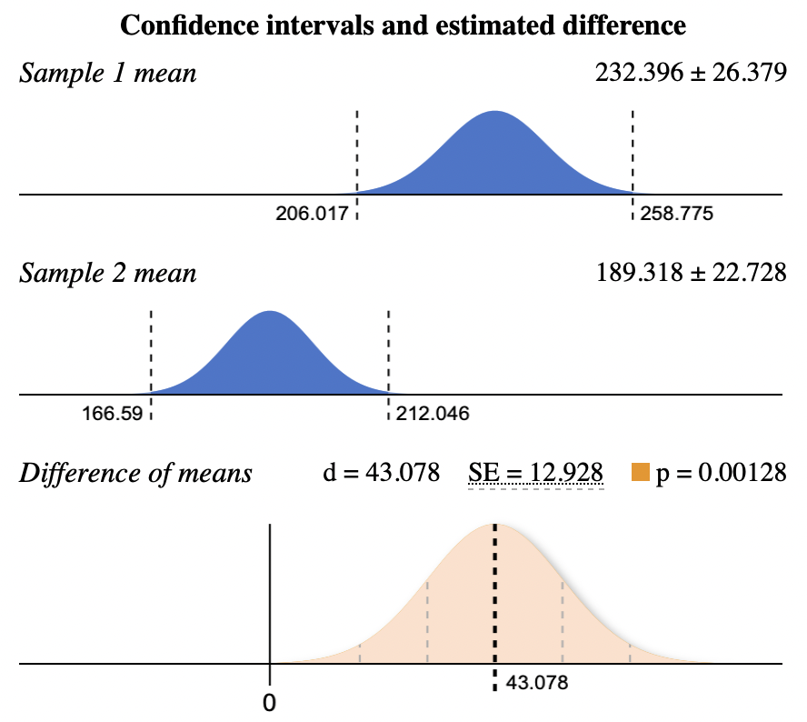
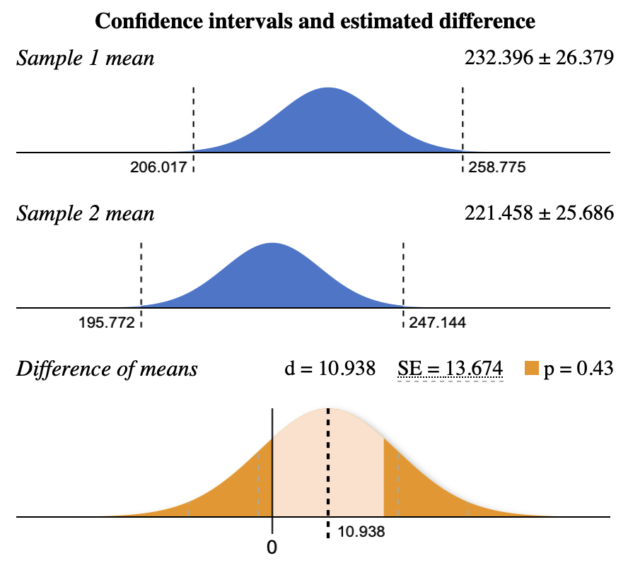
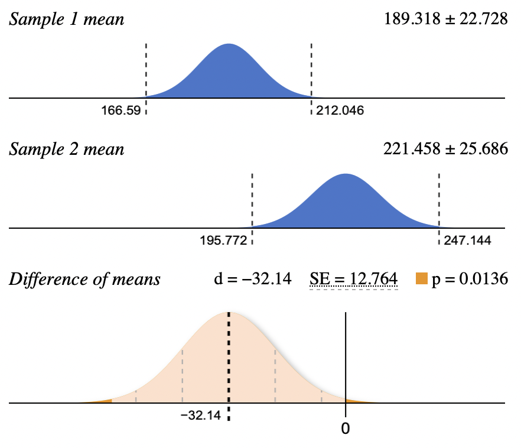

# A/B Testing Analysis: Fast Food Marketing Promotions

**[View the full A/B Test Report (Google Doc)](https://docs.google.com/document/d/1s_NykYjR4rIQtQmPBAca8SxVUSQ_tBa05RwwD0068lc/edit)**

## Objective
A fast food chain ran three different marketing promotions across randomly assigned store
locations and wants to know which one actually drives more sales — and whether it's worth
scaling any of them beyond the test. This analysis uses hypothesis testing to determine
whether the differences in sales between promotions are statistically meaningful or just
noise.

## Data Source
[Fast Food Marketing Campaign A/B Test dataset](https://www.kaggle.com/datasets/chebotinaa/fast-food-marketing-campaign-ab-test)
(Kaggle) — weekly sales by store location and promotion, aggregated by location and
promotion prior to testing.

## Hypotheses
- **Null hypothesis:** There is no difference in mean sales between the promotions.
- **Alternative hypothesis:** There is a difference in mean sales between the promotions.

## Methodology
- **Target metric:** Total sales per location over the 4-week promotion cycle — the clearest
  read on which promotion actually moved revenue by the end of the test window.
- **Multiple comparisons problem:** Since there are three promotions, evaluating "which one
  wins" requires three separate pairwise t-tests (1 vs. 2, 1 vs. 3, 2 vs. 3). Running multiple
  tests increases the chance of a false positive (Type I error), so this analysis uses a
  **99% confidence level** (α = 0.01) instead of the conventional 95%, to keep that risk in
  check.

## Key Findings

### Promotion Summary

| Promotion | Sample Size (n) | Mean Sales ($k) | Std. Dev. |
|---|---|---|---|
| 1 | 43 | 232.40 | 64.11 |
| 2 | 47 | 189.32 | 58.03 |
| 3 | 47 | 221.46 | 65.49 |

### Promo 1 vs. Promo 2
d = 43.078, SE = 12.928, **p = 0.00128** — statistically significant at 99% confidence.
**Reject the null hypothesis** — Promo 1 outperforms Promo 2.

### Promo 1 vs. Promo 3
d = 10.938, SE = 13.674, **p = 0.43** — not statistically significant.
**Fail to reject the null hypothesis** — no meaningful difference detected between Promo 1
and Promo 3.

### Promo 2 vs. Promo 3
d = −32.14, SE = 12.764, **p = 0.0136** — not statistically significant at the 99% confidence
level (though it would be at the conventional 95% level).
**Fail to reject the null hypothesis.**

## Recommendation
**Promotion 1** drove statistically significantly more sales than Promotion 2, and showed no
significant difference from Promotion 3 — making it the strongest, safest choice to scale to
additional locations or future time periods. Promotion 3 has anecdotal support over Promotion 2,
but that gap doesn't clear the 99% confidence bar, so it shouldn't be treated as a confirmed
effect. **Promotion 2 is the clear underperformer** and is not recommended for further rollout
without a redesign; Promotion 3 remains a reasonable fallback when Promotion 1 isn't available.

## Queries
All SQL queries are in the `/queries` folder:

| File | Purpose |
|---|---|
| `queries/promo_summary_stats.sql` | Mean, standard deviation, and sample count by promotion group |
| `queries/promo_total_sales_by_location.sql` | Total sales aggregated by location and promotion, feeding the pairwise t-tests |

## Tools
SQL (aggregation and summary statistics), Google Sheets (organizing query results ahead of
testing), and two-sample t-tests for the pairwise comparisons.

## Limitations
- Store locations were randomly assigned to promotions, but the dataset doesn't capture
  location-level factors (market size, existing foot traffic) that could also explain
  some of the sales variation.
- The 99% confidence threshold is conservative by design given the multiple-comparisons
  issue — real differences with more modest effect sizes (like Promo 2 vs. Promo 3) may be
  getting classified as "not significant" when a less conservative approach would have
  flagged them for further investigation.
